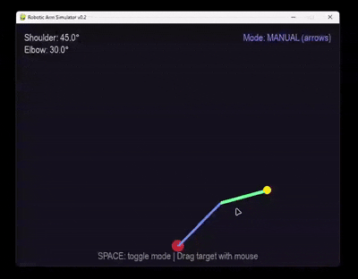

# robot-arm-simulator

2D simulator of a robotic arm with inverse kinematics




\# Robotic Arm Simulator


A lightweight 2D simulator of a 2-link robotic manipulator with forward and inverse kinematics. Control the arm with keyboard arrows or drag a target point with your mouse — the arm will automatically calculate joint angles to reach it.


\##  Features


\- \*\*Forward kinematics\*\*: Calculate end-effector position from joint angles

\- \*\*Inverse kinematics\*\*: Compute joint angles to reach a target point (analytical solution)

\- \*\*Dual control modes\*\*:

&nbsp; - Manual: Arrow keys (`←` `→` `↑` `↓`)

&nbsp; - Automatic: Drag target point with mouse

\- \*\*Reachability check\*\*: Target turns red when unreachable (outside workspace)

\- \*\*Real-time angle display\*\*: See joint angles in degrees

\- \*\*Pure Python\*\*: No heavy dependencies (only Pygame + NumPy)


\## Quick Start


\### Prerequisites

\- Python 3.7–3.11

\- pip (Python package manager)


\### Installation

```bash

\# Clone the repository

git clone https://github.com/cvvlifter/robot-arm-simulator.git

cd robot-arm-simulator


\# Install dependencies

pip install pygame numpy


